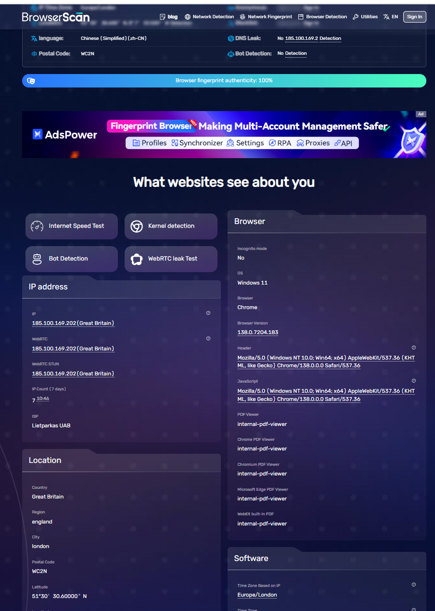
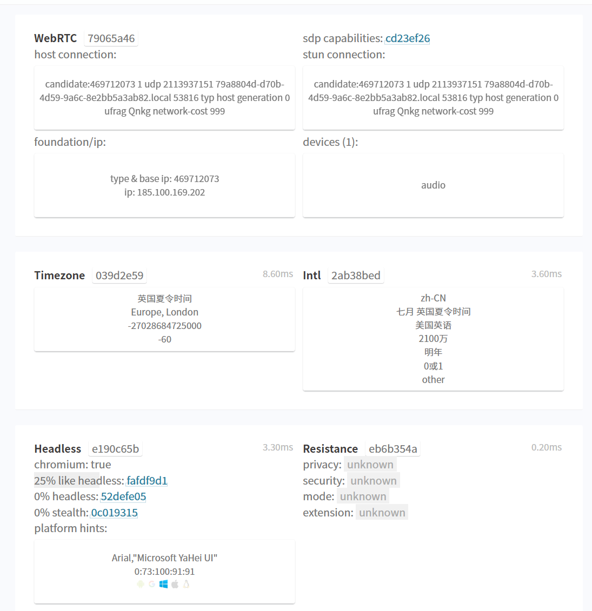
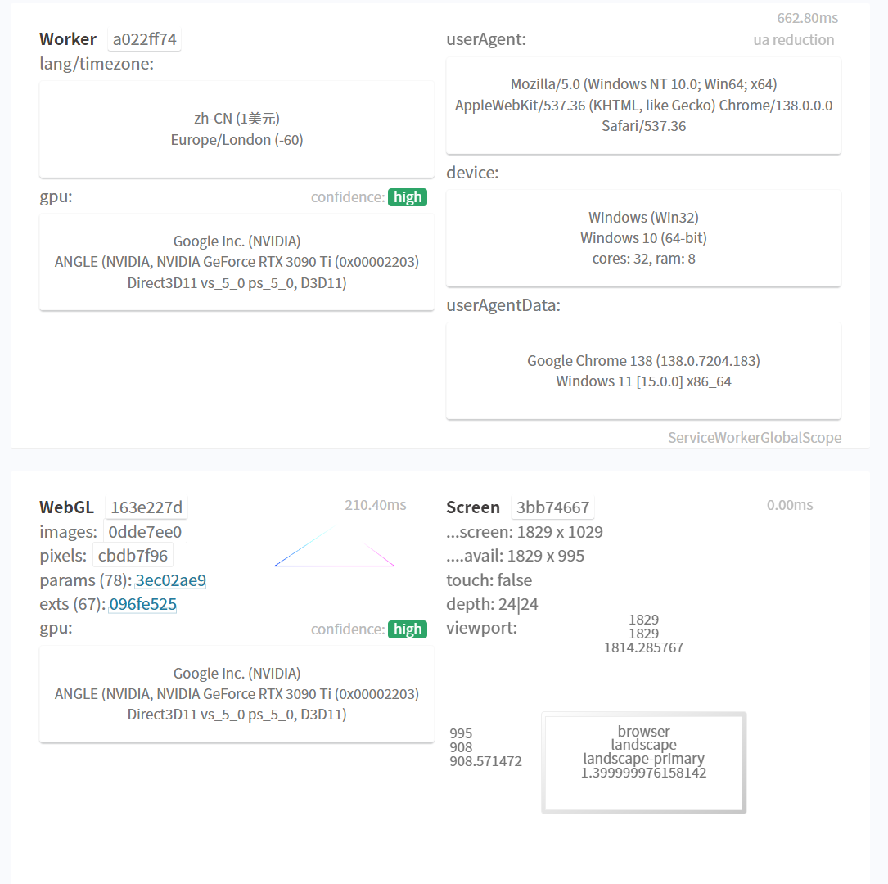
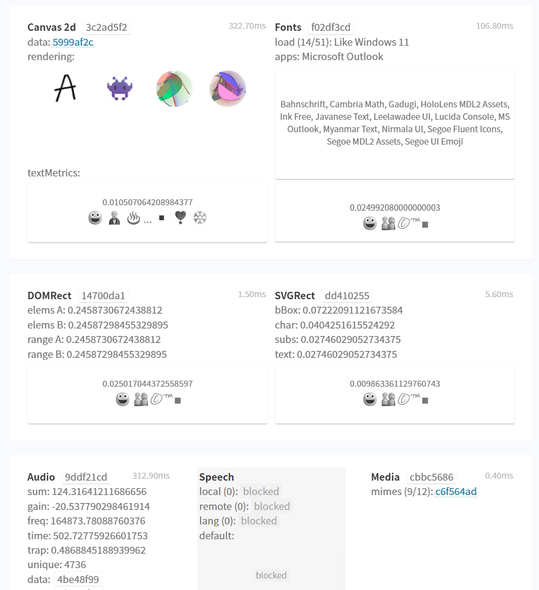
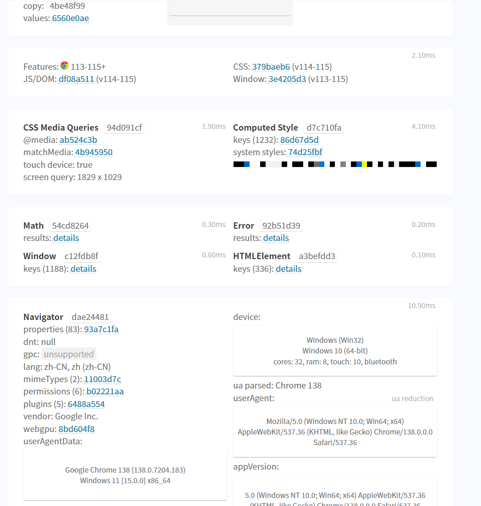
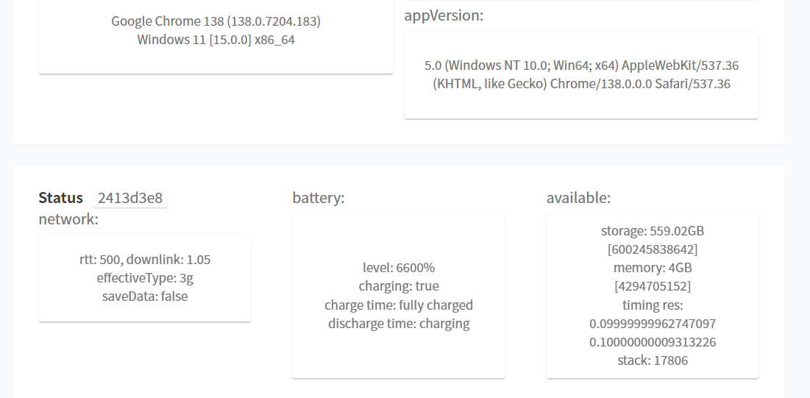

# 指纹浏览器（Fingerprint Browser）

基于 C++ Chromium 内核开发出的指纹浏览器（134版本），可以在release中下载体验。

## 联系方式：
- **注意** 可提供相关技术服务咨询，上面指纹相关功能的技术100-500￥/单个，整套2w，对这个项目感兴趣的朋友可以联系我。
- QQ：1159846487
- 谷歌邮箱：syujie875@gmail.com
- 擅长chromium 源码编译，可以指定任意版本。

## 功能特点：

- **指纹识别防护**：通过多种技术手段防护指纹识别，包括对用户特征的屏蔽和混淆，减少网站对用户身份的识别准确率。
- **功能丰富**：
  - 一个新窗口即为一个全新的指纹浏览器。
  - 管理指纹配置文件即可管理UA、硬件指纹、网络代理、密码填充管理、cookie管理等。
- **代理身份认证**：支持socks、http账号密码认证。
- **多内核版本支持**：支持多个Chromium内核版本（119-138版本）。
- **实际应用场景**：适用于网页数据获取、TikTok/Facebook矩阵养号、海外问卷调研等场景。用户反馈在TikTok、谷歌广告业务方面成功率超过85%。
- **多平台支持**：支持Windows、macOS多个平台。

## 使用方法：
- const fpData = {
    tag: '玉的指纹浏览器',
    memory: 8,
    cpu: 16,
    gpu: {
        gl_vendor: 'Google Inc. (NVIDIA)',
        gl_renderer: 'ANGLE (NVIDIA, NVIDIA GeForce RTX 2060 (0x00001F51) Direct3D9Ex vs_3_0 ps_3_0, D3D9Ex)',
        width:5,//1-9的随机整数
        height:6,
        gl_image:13,
        gpu_vendor: 'intel',
        gpu_arch: 'turing',
    },
    media:{
        charge:1,//charge为1时表示真实设备
        //audio_rd:generateRandomFloat(0.0, 0.5),
        //audio_rd:0,
        audio_input_device:1,
        audio_output_device:1,
        video_input_device:1,
    },
    client_rects:generateRandomFloat(1.00001, 1.00003),
    // client_rects:0,
    screen:{
        charge:1,
        height:1000,
        width:600,
        depth:12,
        task_height:25,
    },
    canvas:{
        // canvas_char:'a',        
        canvas_rand:generateRandomNumber(),
        canvas_char:getRandomCharAF(),
        // canvas_rand:-2,
    },
    port: "0", // 端口扫描保护 值: 0-完全禁止扫描 80,8080,22,3389-以逗号分隔的字符串为开放端口(前提必须是本地已经开放了对应端口)
    geoposition:{
        charge:1,//charge不为1时，使用默认地理位置  1:允许 0：禁止  2:询问
        latitude:22.3527242,
        longitude:114.1394,
        accuracy:1000,
    },
    timezone:"Asia/Hong_Kong",
    voice_tts_list:generateRandomNumbers(0, 118, 48),
    // font:{
    //     charge:0,
    //     font_list:generateRandomNumbers(0, 3554, 243),
    //     family_list:generateFontFamily(),
    //     //abort_family:"Microsoft,MS,Segoe,Webdings,Wingdings,Marlett,Yu,HoloLens",
    // },
    os_ver:"Windows 10",
    task_icon:33,
    battrey:0.6,
};
- 将结构体转化为base64字符串，通过--shi-fp传递即可，下面是简单示例：
- chrome --shi-fp="eyJ0YWciOiLnjonnmoTmjIfnurnmtY/op4jlmagiLCJtZW1vcnkiOjgsImNwdSI6MTYsImdwdSI6eyJnbF92ZW5kb3IiOiJHb29nbGUgSW5jLiAoTlZJRElBKSIsImdsX3JlbmRlcmVyIjoiQU5HTEUgKE5WSURJQSwgTlZJRElBIEdlRm9yY2UgUlRYIDIwNjAgKDB4MDAwMDFGNTEpIERpcmVjdDNEOUV4IHZzXzNfMCBwc18zXzAsIEQzRDlFeCkiLCJ3aWR0aCI6NSwiaGVpZ2h0Ijo2LCJnbF9pbWFnZSI6MTMsImdwdV92ZW5kb3IiOiJpbnRlbCIsImdwdV9hcmNoIjoidHVyaW5nIn0sIm1lZGlhIjp7ImNoYXJnZSI6MSwiYXVkaW9faW5wdXRfZGV2aWNlIjoxLCJhdWRpb19vdXRwdXRfZGV2aWNlIjoxLCJ2aWRlb19pbnB1dF9kZXZpY2UiOjF9LCJjbGllbnRfcmVjdHMiOjEuMDAwMDIyNDU5MDQzODA5NCwic2NyZWVuIjp7ImNoYXJnZSI6MSwiaGVpZ2h0IjoxMDAwLCJ3aWR0aCI6NjAwLCJkZXB0aCI6MTIsInRhc2tfaGVpZ2h0IjoyNX0sImNhbnZhcyI6eyJjYW52YXNfcmFuZCI6MTc3ODgyMzcwMCwiY2FudmFzX2NoYXIiOiJjIn0sImdlb3Bvc2l0aW9uIjp7ImNoYXJnZSI6MSwibGF0aXR1ZGUiOjIyLjM1MjcyNDIsImxvbmdpdHVkZSI6MTE0LjEzOTQsImFjY3VyYWN5IjoxMDAwfSwidGltZXpvbmUiOiJBc2lhL0hvbmdfS29uZyIsInZvaWNlX3R0c19saXN0IjoiMzUsNzgsNzEsNiwxMDksNzUsNDgsMTEsNjAsMzQsMzIsODMsMjgsMTYsMjMsODQsMTA3LDc3LDEwMCwzLDY0LDEwMSw1Niw1NSw1Nyw2OCwxMTgsMjYsNTEsNjUsNjMsOTYsMTksNTgsNDIsMTAzLDEyLDg2LDk3LDExMiw0MCwxMDQsODksNywxMDUsNjksMzksNzIiLCJvc192ZXIiOiJXaW5kb3dzIDEwIiwidGFza19pY29uIjozMywiYmF0dHJleSI6MC42LCJtb2JpbGUiOjV9" --user-data-dir=./my_user_data
- 修改webrtc暴露的ip，传递--webrtc-ip=185.100.169.202；
- 设置数据目录传递--user-data-dir=./my_user_data；
- 设置代理，传递--proxy-server=socks5://主机:端口@账号:密码。
### 支持的指纹和功能

- 语言
- 时区
- 地理位置
- 分辨率
- 字体指纹
- WebRTC
- WebGL 图像
- WebGL Info
- Canvas
- AudioContext
- Speech Voices
- Do Not Track
- Client Rects
- User Agent
- 媒体设备
- 设备名称
- MAC地址
- 硬件并发数
- 设备内存
- SSL指纹设置
- 端口扫描保护
- 硬件加速模式
- 电池状态
- 蓝牙
- cdp检测
- 机器人检测

#### 其他功能

- 默认打开指定网站
- 启动自带指定插件
- 支持上传、移除自定义拓展
- 禁止网站播放声音
- 禁止恢复窗口弹窗
- 禁止拓展调试窗口
- 禁止默认浏览器检查
- 自定义地理位置权限
- 图标替换
- 动态设置任务栏图标
- 进程名称替换
- 网站账号密码填充
- 用户数据同步
- 拦截浏览器关闭事件
- 动态设置浏览器主题
- 获取窗口句柄
- 使用cdp自动化控制浏览器
- 等等

## 使用说明

如果您在使用过程中遇到问题或需要技术支持，欢迎随时联系我。同时对于更深入的技术咨询和定制化开发服务，您可以选择付费咨询。

## 成品展示

